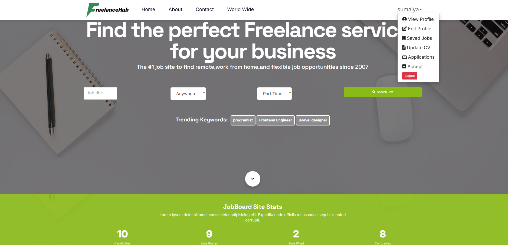
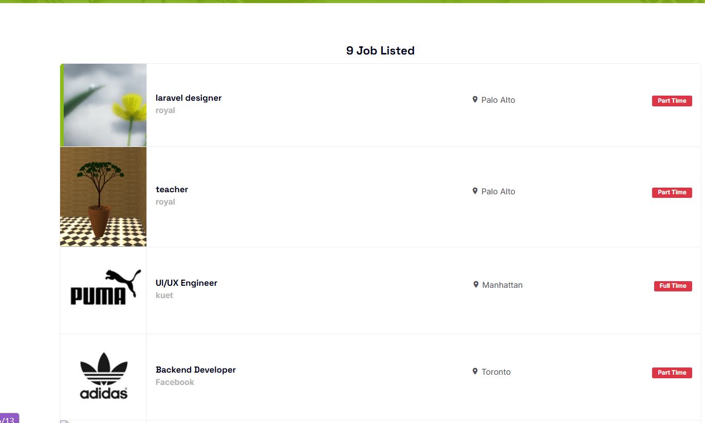
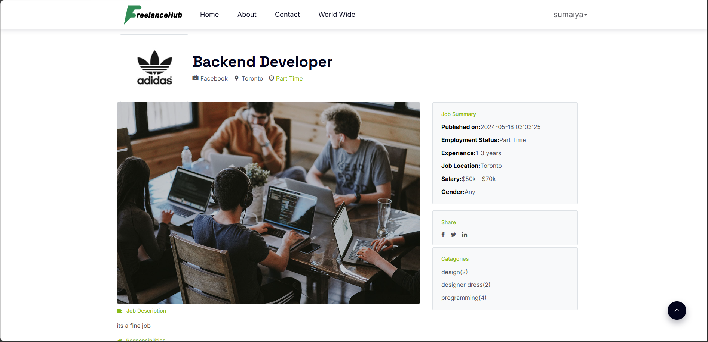
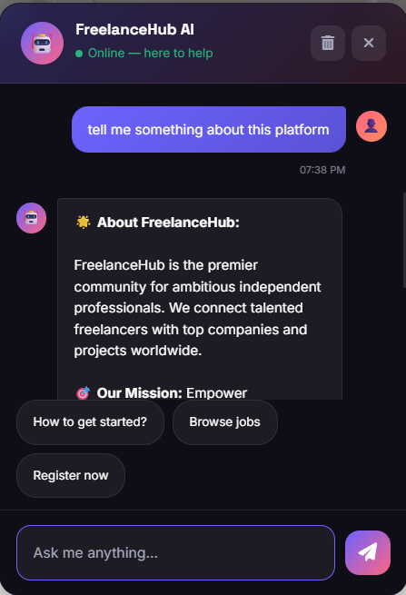
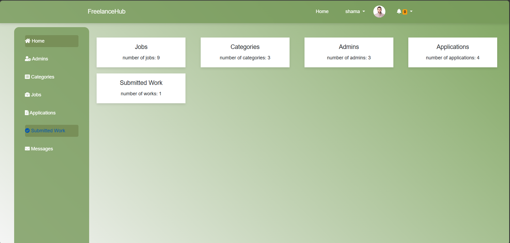

# FreelanceHub 🚀

FreelanceHub is a premier community for ambitious independent professionals. It connects talented freelancers with top companies and projects worldwide. Built with **Laravel**, **FastAPI** (for AI integrations), and **Stripe**, FreelanceHub offers a secure, scalable, and intuitive platform for the gig economy.

## ✨ Features

- **Job Management:** Browse, search, save, and apply for freelance jobs across multiple categories.
- **Employer Portal:** Post jobs, review applications, and accept proposals.
- **Freelancer Profiles:** Comprehensive profile management including skills, bio, and CV uploads.
- **Secure Payments:** Integrated with Stripe for seamless, encrypted transactions upon work completion.
- **AI Support Agent:** A smart, built-in AI chatbot (powered by a local Python FastAPI backend) that provides 24/7 contextual help to users, answers queries about platform usage, and reduces support tickets.
- **Admin Dashboard:** Powerful admin capabilities to manage users, categories, applications, jobs, and platform settings.

## 📸 Screenshots

 
| Home / Landing Page | mobile screeen |
|---|---|
|  |  |
 
| Job Listings | Job Description |
|---|---|
|  |  |
 
| AI Chat Agent | Admin Dashboard |
|---|---|
|  |  |
 
> 📂 **Full-resolution screenshots and a project walkthrough video are available in the [Google Drive folder](https://drive.google.com/file/d/1KuMzlcIozV6VRJdOG9X9t39fXp1L7YLW/view?usp=sharing).**
 
---

## 🛠 Tech Stack

- **Backend (Main):** [Laravel](https://laravel.com/) (PHP)
- **Backend (AI Chatbot):** [FastAPI](https://fastapi.tiangolo.com/) (Python)
- **Database:** MySQL (Laravel) & SQLite (AI Chat History)
- **Payments:** [Stripe API](https://stripe.com/)
- **Frontend:** HTML, Vanilla CSS, JS

## 🚀 Getting Started (Local Development)

Follow these steps to set up the project locally.

### 1. Prerequisites
- PHP >= 8.1
- Composer
- Python 3.10+
- MySQL / MariaDB

### 2. Install Laravel Application
Clone the repository and install the PHP dependencies:

```bash
git clone https://github.com/sumaiyashifa/freelancehub.git
cd freelancehub
composer install
```

Copy the `.env.example` file and configure your database and Stripe keys:
```bash
cp .env.example .env
php artisan key:generate
php artisan migrate
```

### 3. Start the Laravel Server
```bash
php artisan serve
```
Your main application will be available at `http://127.0.0.1:8000`.

### 4. Setup and Start the AI Backend
The AI Chat Agent runs as an independent microservice. Navigate to the `ai_backend` folder:

```bash
cd ai_backend

# Create and activate a virtual environment
python -m venv venv
.\venv\Scripts\activate   # On Windows
# source venv/bin/activate # On macOS/Linux

# Install dependencies
pip install -r requirements.txt

# Start the FastAPI server
python app.py
```
The AI backend will start on `http://127.0.0.1:5000`. 

## 🔐 Admin Access
To manage the platform, access the secure Admin Panel:
- **Login URL:** `/admin/login` (e.g., `http://127.0.0.1:8000/admin/login`)
- **Dashboard:** `/admin`

## 📄 License
This project is open-source and available under the [MIT License](LICENSE).
